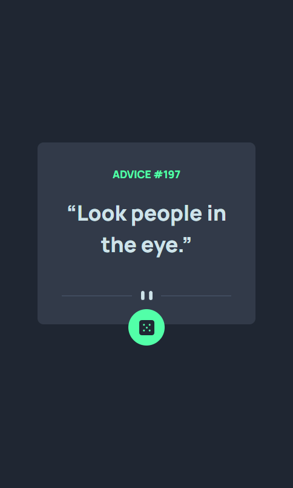
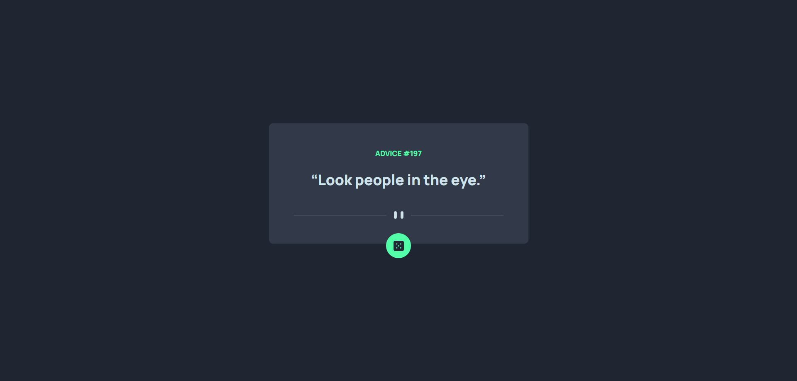
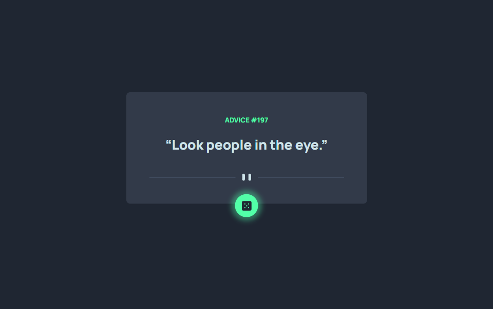

# Frontend Mentor - Advice generator app solution

This is a solution to the [Advice generator app challenge on Frontend Mentor](https://www.frontendmentor.io/challenges/advice-generator-app-QdUG-13db). Frontend Mentor challenges help you improve your coding skills by building realistic projects.

## Table of contents

- [Overview](#overview)
  - [The challenge](#the-challenge)
  - [Screenshot](#screenshot)
  - [Links](#links)
- [My process](#my-process)
  - [Built with](#built-with)
  - [What I learned](#what-i-learned)
  - [Continued development](#continued-development)
  - [Useful resources](#useful-resources)
- [Author](#author)

## Overview

### The challenge

Users should be able to:

- View the optimal layout for the app depending on their device's screen size
- See hover states for all interactive elements on the page
- Generate a new piece of advice by clicking the dice icon

### Screenshot

Mobile Design 

Desktop Design

With Hover State

### Links

- Solution URL: [repo link](https://github.com/EricsonRemocal05/advice-generator-app)
- Live Site URL: [live site](https://tiny-pie-9cb241.netlify.app/)

### Built with

- Semantic HTML5 markup
- Mobile-first workflow
- [React](https://reactjs.org/) - JS library
- [Tailwind CSS](https://tailwindcss.com/) - For styles

### What I learned

To use tailwind css

### Continued development

Continue practice using an API

### Useful resources

- [Tailwind CSS](https://tailwindcss.com/) - This helped me for developing website

**Note: Delete this note and replace the list above with resources that helped you during the challenge. These could come in handy for anyone viewing your solution or for yourself when you look back on this project in the future.**

## Author

- Frontend Mentor - [@EricsonRemocal05](https://www.frontendmentor.io/profile/EricsonRemocal05)
- Twitter - [@EricsonRemocal](https://twitter.com/EricsonRemocal)

**Note: Delete this note and add/remove/edit lines above based on what links you'd like to share.**
